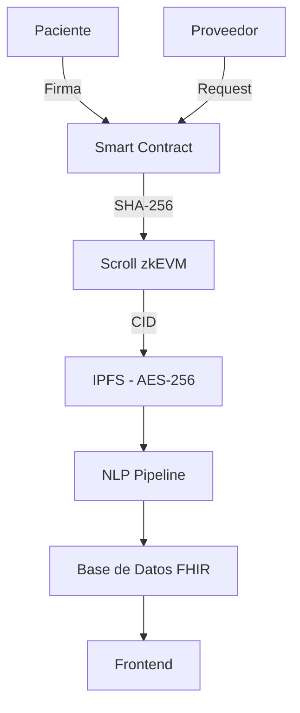

# ¿Y si la blockchain pudiera certificar y centralizar tu historial médico?

# 🩺 HistorialMedicoChain  
## Sistema Descentralizado de Certificación de Historial Clínico Electrónico

### 🌐 Visión  
Infraestructura blockchain que garantiza **integridad criptográfica, descentralización y soberanía de datos** en el ecosistema de salud digital. Elimina la fragmentación sistémica mediante **registro distribuido inmutable** con control granular del paciente.

---

## 🧩 Análisis del Problema  
El sistema sanitario peruano presenta **fragmentación crítica de datos clínicos** en silos institucionales desconectados, generando **redundancia diagnóstica**, incremento de costos y latencia en acceso a información crítica. La ausencia de **trazabilidad criptográfica** compromete privacidad y auditoría del flujo de información sensible.

---

## 💡 Arquitectura: *Salud-Chain Perú*  
Arquitectura **híbrida blockchain-IA** que separa almacenamiento (*Off-Chain*) de gestión de permisos (*On-Chain*), garantizando **inmutabilidad, trazabilidad y escalabilidad**.

### Componentes Core

- **🔒 Capa de Certificación:**  
  **DLT** registra hashes criptográficos (SHA-256) generando **pruebas de existencia inmutables** con firma digital. Verificación mediante **Merkle Trees** asegura integridad end-to-end.

- **🧠 Motor NLP:**  
  Pipeline basado en **transformers (BERT/GPT)** para normalización semántica de notas médicas. **NER** extrae terminología (ICD-10, SNOMED CT) compatible con **HL7 FHIR**. Anonimización mediante **k-anonymity** para datasets de investigación.

- **🧍‍♀️ Gestión de Acceso Descentralizado:**  
  Cifrado **AES-256** en capa *Off-Chain* (IPFS). **Smart Contracts ERC-721** gestionan permisos mediante **Time-Locked Access Control**. El paciente custodia claves privadas para autorizar acceso temporal vía **OAuth 2.0 + DID**.

> **Stack:** **Scroll zkEVM** (Ethereum L2) con **zk-Rollups** reduce costos de gas ~100x manteniendo seguridad de mainnet.

---

## ⚙️ Flujo Operacional

1. **Certificación On-Chain:** Hash del documento registrado en smart contract con **timestamp inmutable**
2. **Almacenamiento Off-Chain:** Documento cifrado (AES-256-GCM) en IPFS retorna **CID** vinculado al hash On-Chain
3. **Gestión de Permisos:** `grantAccess(address, duration)` emite **Access Token** temporal validable On-Chain
4. **Pipeline IA:** ETL ejecuta normalización NLP y almacenamiento en PostgreSQL con índices FHIR
5. **Frontend Web3:** UX simplificada con MetaMask oculta complejidad blockchain

---

### 📊 Arquitectura - Alto nivel

---

## 👥 Propuesta de Valor

**Target:** Infraestructura nacional (MINSA, ESSALUD) y redes privadas.

**Beneficios:**  
- **CAPEX:** Single source of truth criptográficamente verificable
- **Compliance:** Trazabilidad compatible con Ley N° 29733
- **Latencia:** Acceso < 2 segundos con índices optimizados

**UX:** Middleware invisible, experiencia tradicional sin requerir conocimiento Web3.

---

## 💰 Modelo de Sostenibilidad

| Revenue Stream           | Cliente              | Mecanismo                                                  |
|--------------------------|----------------------|------------------------------------------------------------|
| **Transaction Fees**     | Instituciones Salud  | ≈0.0001 ETH/tx en L2                                       |
| **API NLP**              | Redes Hospitalarias  | Freemium: 10K requests/mes, tiers enterprise SLA 99.9%     |

---

## ⚠️ Limitaciones y Estrategia

**Barrera:** Gap técnico en adopción Web3 en instituciones legacy.

**Estrategia:**  
- **B2B2C:** Subsidio de gas fees por proveedores, zero-cost para pacientes
- **Meta-transactions (EIP-2771):** Gasless wallets para abstracción total
- **Integración:** APIs REST compatibles HL7 v2.x y FHIR R4

---

## 🧪 Estado Actual

**HistorialMedicoChain es actualmente un prototipo funcional** que demuestra viabilidad técnica de blockchain e IA en gestión de historial médico:  
- Smart contracts desplegados en **testnet Scroll Sepolia** (entorno de pruebas)
- Motor NLP con precisión >85% evaluado en corpus de investigación (MIMIC-III)
- Frontend demo con integración MetaMask/WalletConnect

**Próximos pasos:** Validación en entornos reales, piloto institucional Q1 2026, integración con sistemas nacionales (SUSALUD), y auditoría de seguridad (Certik/OpenZeppelin) pre-mainnet deployment.

---

**💬 Salud-Chain Perú: sistema distribuido, criptográficamente seguro y centrado en el paciente mediante blockchain L2.**

---
## Créditos  

El presente documento fue concebido y desarrollado por un equipo humano(ov), con el apoyo de herramientas de inteligencia artificial entre ellas **GitHub Copilot**, **Claude**, **ChatGPT**, **Lovable**, **Bolt** y **DeepSeek**, empleadas exclusivamente para optimizar la estructura, redacción, coherencia del contenido y apoyo técnico en el desarrollo de código, sin reemplazar el criterio ni la autoría humana.

---
MIT License (Adaptada para uso educativo y social)

Copyright (c) 2025 Salud-Chain Perú

Se concede permiso, de forma gratuita, a cualquier persona que obtenga una copia
de este software y archivos de documentación asociados (el "Software"), para usar
el Software sin restricción, incluyendo sin limitación los derechos para usar,
copiar, modificar, fusionar, publicar, distribuir, sublicenciar y/o vender copias
del Software, siempre que el uso esté orientado a fines **educativos, sociales o
sin ánimo de lucro**.

La condición anterior no limita el derecho a usar el Software en proyectos
comerciales, pero se recomienda que cualquier uso comercial considere contribuir
al desarrollo social o educativo.

EL SOFTWARE SE PROPORCIONA "TAL CUAL", SIN GARANTÍA DE NINGÚN TIPO, EXPRESA O
IMPLÍCITA, INCLUYENDO PERO NO LIMITADO A GARANTÍAS DE COMERCIALIZACIÓN,
IDONEIDAD PARA UN PROPÓSITO PARTICULAR Y NO INFRACCIÓN. EN NINGÚN CASO LOS
AUTORES O TITULARES DEL COPYRIGHT SERÁN RESPONSABLES POR NINGUNA RECLAMACIÓN,
DAÑO U OTRA RESPONSABILIDAD, YA SEA EN UNA ACCIÓN DE CONTRATO, AGRAVIO O DE
OTRA MANERA, QUE SURJA DE, FUERA DE O EN CONEXIÓN CON EL SOFTWARE O EL USO U
OTRAS OPERACIONES EN EL SOFTWARE.
